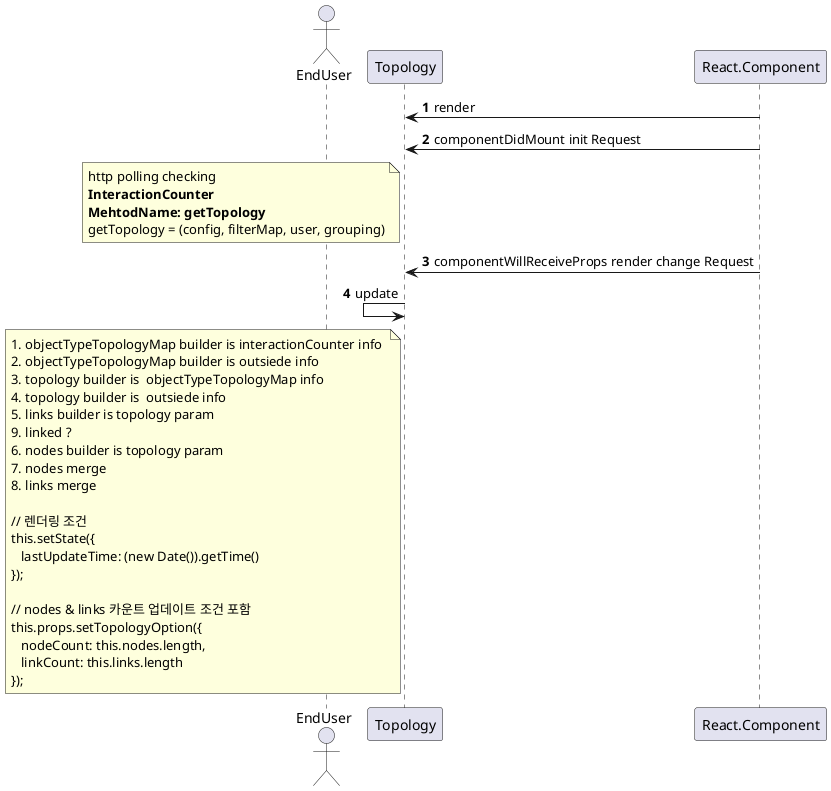

# 1. component topology data flow
 - 데이터 처리 방법을 분석 한다. 

```plantuml 
@startuml
actor EndUser

autonumber
Topology <- React.Component: render
Topology <- React.Component: componentDidMount init Request
note left of Topology
 http polling checking 
 <b>InteractionCounter 
 <b>MehtodName: getTopology 
 getTopology = (config, filterMap, user, grouping)
end note
Topology <- React.Component: componentWillReceiveProps render change Request

Topology <- Topology : update
note left of Topology
 1. objectTypeTopologyMap builder is interactionCounter info 
 2. objectTypeTopologyMap builder is outsiede info 
 3. topology builder is  objectTypeTopologyMap info 
 4. topology builder is  outsiede info 
 5. links builder is topology param
 9. linked ?
 6. nodes builder is topology param
 7. nodes merge
 8. links merge
 
 // 렌더링 조건   
 this.setState({
    lastUpdateTime: (new Date()).getTime()
 });
 
 // nodes & links 카운트 업데이트 조건 포함  
 this.props.setTopologyOption({
    nodeCount: this.nodes.length,
    linkCount: this.links.length
 });    
end note
@enduml
``` 